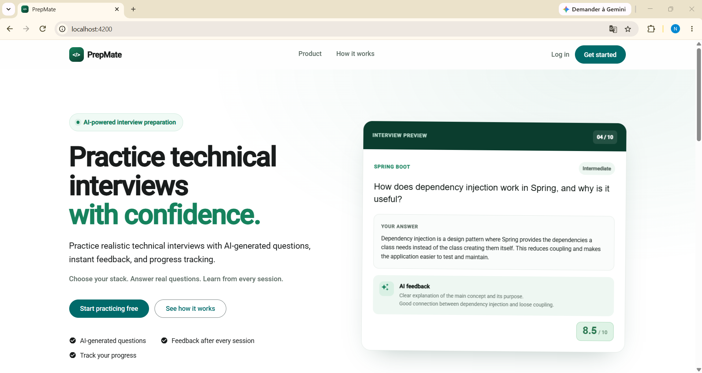
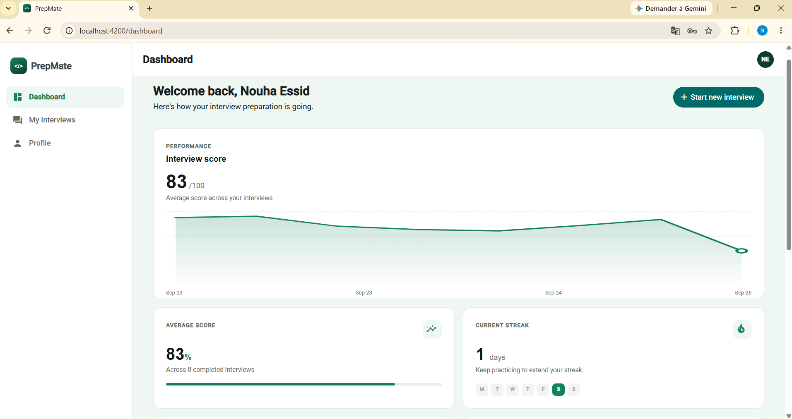
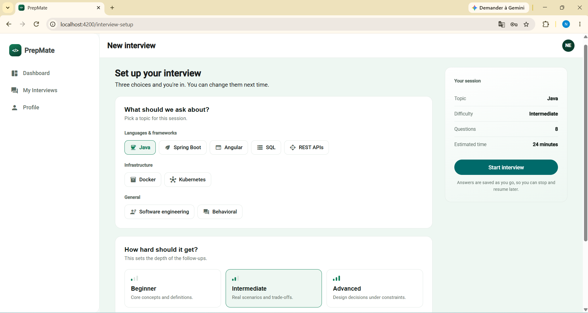
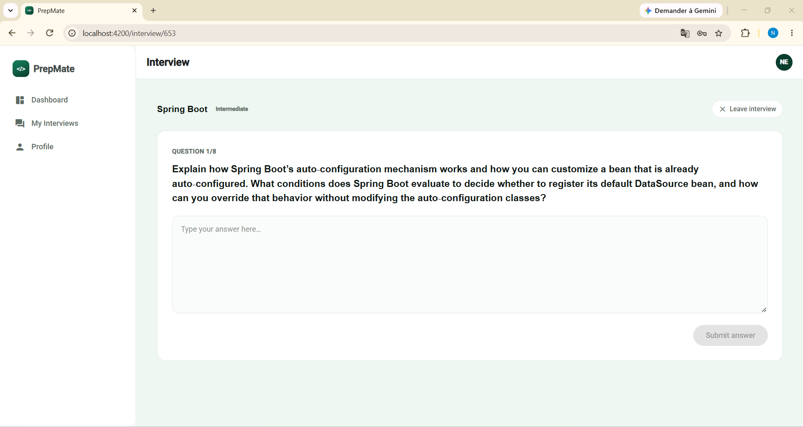

# PrepMate — AI Technical Interview Preparation Platform

A modern **AI-powered technical interview preparation frontend built with Angular 22**, integrated with a **Spring Boot microservices backend**, **Tailwind CSS**, **Angular Material**, and **Keycloak with a customized authentication theme**.

PrepMate allows users to practice technical interviews through AI-generated questions, submit answers, receive detailed evaluations, resume interviews, review results, and track their interview performance.

**Backend:** [PrepMate Backend](https://github.com/nouhaessid/prepmate-backend/)

---

## Screenshots

<p align="center">
  
  
</p>

<p align="center">
  
  
</p>

---

## Demo

A walkthrough of the PrepMate application, including authentication, interview setup, AI-generated questions, answer evaluation, and performance tracking.

[](https://youtu.be/mXFyvs1KSNA)

---

## Features

* User registration and authentication through Keycloak
* Interview setup with topic, difficulty, and question count
* AI-generated technical interview questions
* One-question-at-a-time interview experience
* Answer submission and AI-powered evaluation
* Scores, feedback, strengths, weaknesses, and suggested answers
* Resume in-progress interviews
* Interview history and completed results
* Dashboard with performance statistics and score history
* Profile statistics and practiced-topic breakdown

---

## Frontend Architecture

The application follows a **standalone component-based Angular architecture** with reusable components, API services, models, authentication, **route guards**, and custom pipes.

### Reactive State

**Angular Signals** are used for reactive component state and derived state.

**Computed signals** provide values derived from application state, such as average scores, completed interview counts, recent interviews, topic statistics, and current interview state.

**RxJS Observables** are used for asynchronous HTTP communication, with API responses converted into component state.

### Authentication & Authorization

**Keycloak** provides authentication and authorization using JWT access tokens.

The frontend uses:

* **Authentication service** to encapsulate Keycloak operations
* **Route guards** to protect authenticated application routes
* Authenticated API requests using JWT access tokens
* Backend ownership checks for interview sessions

PrepMate also uses a **customized Keycloak authentication theme** to provide a consistent authentication experience with the application.

### Reusable Components & Content Projection

Authenticated pages share a reusable **AppShell** component for common navigation and page structure.

The application also uses **Angular content projection (`ng-content`)** to allow individual pages to provide their own content inside the shared layout.

### AI Content Rendering

AI-generated feedback and suggested answers can contain Markdown formatting.

The application uses a **custom Markdown pipe** that:

* Converts Markdown to HTML using Marked
* Sanitizes generated HTML using **DOMPurify**
* Uses Angular's `DomSanitizer` for safe HTML rendering

---

## Technology Stack

| Technology       | Purpose                          |
| ---------------- | -------------------------------- |
| Angular 22       | Frontend framework               |
| TypeScript       | Application development          |
| Angular Signals  | Reactive state management        |
| RxJS             | Asynchronous API communication   |
| Angular Material | UI components                    |
| Tailwind CSS     | Styling and responsive design    |
| Keycloak         | Authentication and authorization |
| JWT              | Authenticated API access         |
| Marked           | Markdown processing              |

---

## Backend Integration

The frontend communicates with the backend through the **API Gateway**.

```text
Angular Frontend
       │
       ▼
   API Gateway
       │
       ├── User Service
       │
       └── Interview Service
                │
                ▼
            AI Service
```

The frontend uses dedicated Angular API services to communicate with the backend.

The **Interview Service** manages interview sessions, questions, answers, and evaluations, while the **AI Service** provides question generation and answer evaluation.

For the complete backend architecture, microservices, authentication, databases, AI integration, and infrastructure details, see the [backend repository](YOUR_BACKEND_REPOSITORY_URL).

---

## Getting Started

### Prerequisites

* Node.js
* npm
* Angular CLI
* Running PrepMate backend services
* Running Keycloak instance

### 1. Clone the repository

```bash
git clone https://github.com/nouhaessid/prepmate-frontend.git
cd prepmate-frontend
```

### 2. Install dependencies

```bash
npm install
```

### 3. Configure the environment

Configure the required frontend environment values, including the backend API and Keycloak configuration.

Make sure the PrepMate backend services and Keycloak are running.

### 4. Start the application

```bash
ng serve
```

The application will be available at:

```text
http://localhost:4200
```

---

## Building

To create a production build:

```bash
ng build
```

The build artifacts are generated in the `dist/` directory.

---

## Future Improvements

* CI/CD pipeline
* Expanded unit and integration testing
* Production deployment
* Additional interview and AI-powered features
* Further performance and accessibility improvements

---

## Related Repository

**Backend:** [PrepMate Backend](https://github.com/nouhaessid/prepmate-backend/)

The frontend and backend repositories together form the complete **PrepMate AI technical interview preparation platform**.
